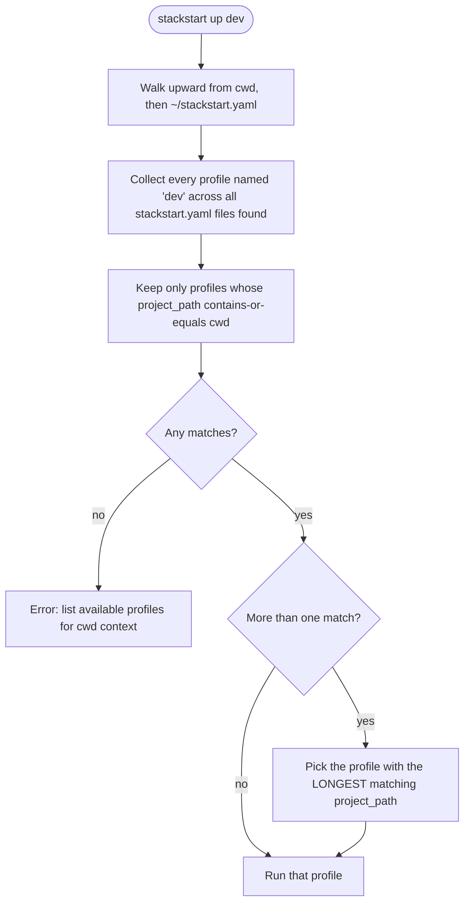
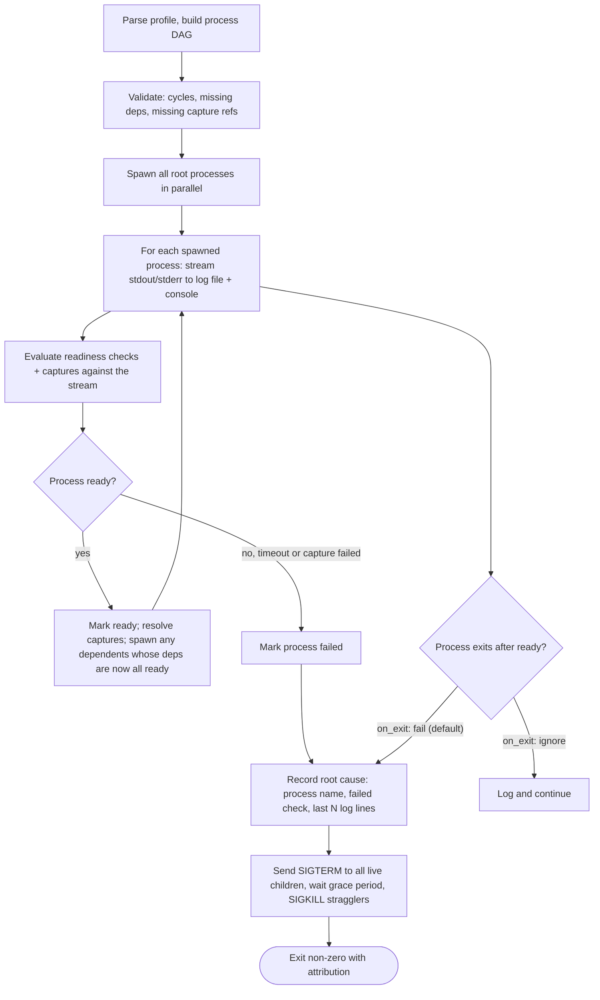

<!-- Stackstart - https://github.com/orpic/stack-start -->
<!-- Copyright (c) 2026 Shobhit. All rights reserved. See LICENSE. -->

# Stackstart - Product Requirements Document

> **One-line positioning:** Stackstart is a runtime-aware local development orchestrator that starts and coordinates multi-service environments deterministically - with explicit dependencies, readiness gates, and runtime value propagation between processes.

This PRD defines the v1 scope. It is the contract between intent (what the product is) and implementation (how it is built). Detailed implementation choices live in [TECH.md](TECH.md). The original problem articulation lives in [PROBLEM_STATEMENT.md](PROBLEM_STATEMENT.md).

---

## 1. Problem (distilled)

Local development for non-trivial multi-service applications today is a manual choreography:

- Each service has its own start command, working directory, and environment - usually scattered across a monorepo.
- Services have an **implicit and unenforced execution order**. Developers eyeball logs ("listening on port 3000", "iex(1)>", "waiting for connection") to guess when a process is "ready" before launching the next one.
- Some processes generate **runtime values** (e.g. `cloudflared` prints a tunnel URL on startup) that must be **manually copied into the environment of dependent services**. Miss this step and dependents start broken.
- There is **no centralized visibility** into which processes are up, ready, failing, or blocked. Failures cascade silently.
- The same project may need **different startup configurations** ("just the backend", "full stack with tunnel", "tooling sidecar") - today these live in tribal knowledge or scattered shell scripts.
- Switching between projects, or onboarding a new developer, means relearning this choreography from scratch.

The result: high cognitive load, non-deterministic environments, broken setups that are hard to attribute, and routine setup that should take one command instead taking ten.

## 2. Goals and non-goals

### Goals (v1)

1. **Deterministic startup**: declared dependencies are honored; a process never starts before the processes it depends on are ready.
2. **Machine-checkable readiness**: process readiness is defined by explicit signals (log regex, TCP port), not human eyeballing.
3. **Runtime value propagation**: values produced by one process at startup (URLs, tokens, ports) are captured and made available to dependent processes - via env vars, rendered config files, or command-line arguments.
4. **Named, scoped profiles**: a project can declare multiple named startup configurations (e.g. `dev`, `tooling`, `minimal`). Profiles can live at the project level or in user-level config and are looked up by `(name, project_path)`.
5. **Clear failure attribution**: when something fails, the user gets one root-cause line (which process, which check, which output) - not a wall of text.
6. **Cross-shell visibility**: from any shell, the user can ask "what's running?", tail a process's logs, and stop the stack cleanly.
7. **Single static binary**: install with `brew install`, no language runtime required.

### Non-goals (v1)

Stackstart is **not**:

- A daemon or background service.
- A TUI dashboard.
- An auto-restart / supervisor / liveness-probing system.
- A cascade-restart system that reacts to mid-run value changes.
- A container orchestrator, deploy tool, or remote execution tool.
- A terminal multiplexer or replacement for tmux/zellij.
- A secrets manager.
- A Windows tool (v1 targets macOS and Linux only).

Anything that requires a long-lived background process beyond the lifetime of a `stackstart up` invocation is out of v1.

## 3. Target users and primary use cases

### Primary user

A developer working in a monorepo (or any multi-service project) who:

- Runs 3+ interdependent local processes daily (database, backend, frontend, tunnel, worker, etc.).
- Currently manages this with shell scripts, `tmux` sessions, manual terminal tabs, or memorized incantations.
- Wants the same workflow to work for teammates and survive onboarding. A project-committed `stackstart.yaml` is share-friendly by design - no absolute paths, just `stackstart up <name>` after cloning.

### Canonical use case: the cloudflared example

A typical "full stack with tunnel" workflow today looks like:

1. Open terminal, `cd packages/db`, run `docker compose up -d postgres`, wait until ready.
2. Open new tab, `cd packages/tunnel`, run `cloudflared tunnel --url http://localhost:4000`.
3. Watch the tunnel logs. Wait for a line like `https://random-words-1234.trycloudflare.com`. Copy that URL by hand.
4. Open new tab, `cd packages/backend`, paste the URL into `TUNNEL_URL=...`, run `npm run dev`.
5. Wait for `listening on port 4000`.
6. Open new tab, `cd packages/web`, run `npm run dev`.
7. Hope nothing crashed silently.

With stackstart this becomes:

```bash
stackstart up dev
```

The profile `dev` declares each process, its working directory, its readiness signal, and (for `cloudflared`) a `captures:` entry that extracts the tunnel URL and exposes it to the backend's environment. The processes start in dependency order, in parallel where possible, with interleaved colored logs in one terminal. If anything fails, the run aborts with a clear root cause and tears everything down.

## 4. Differentiation

Stackstart's wedge: **readiness-aware dependencies + runtime value propagation + name+path-scoped profiles**. Existing tools cover slices but none cover all three:

- **`foreman`, `hivemind`, `overmind`**: run a `Procfile` of processes in parallel with interleaved logs. No deps, no readiness, no value propagation, no profiles.
- **`mprocs`, `process-compose`**: TUI-driven multi-process runners. `process-compose` has dependency support and basic readiness probes but no runtime value propagation between processes; it is also primarily TUI-oriented.
- **`docker-compose`**: solves orchestration for containers, not host processes. `depends_on` with health checks is similar in spirit but the container model is the wrong abstraction for a developer running host processes (Postgres in a container is fine; a Node dev server with hot reload, less so).
- **`devenv`, `nix-direnv`**: solve declarative environment setup, not process orchestration.
- **`tmuxinator`, `itermocil`**: open terminal tabs/panes with predefined commands. No deps, no readiness, no value propagation, no failure attribution - just layout.
- **Bash scripts**: cover everything in the worst possible way.

Stackstart is the orchestrator that treats a developer's local stack the way `docker-compose` treats containers - but for **host processes**, with **first-class runtime value propagation**, and with **profiles scoped by both name and project path** so a single `~/stackstart.yaml` can hold defaults across many projects.

## 5. Core concepts

- **Process** - a single command stackstart spawns and owns. Has a `cwd`, a command, an environment, optional readiness checks, and optional captures.
- **Dependency** - a directed edge: `A depends on B` means `B` must be ready before `A` starts.
- **Readiness check** - a machine-checkable signal that a process is ready: log regex match (per-line, unanchored, against the merged stdout+stderr stream) or TCP port open. Multiple checks combinable with `mode: any | all`. A mandatory timeout per check.
- **Capture** - a named regex extraction from a process's log stream. Required captures must match before the process is considered ready, so dependents never see a missing value. Captures are referenced from dependents via an explicit `${producer.capture_name}` syntax (final syntax to be specified in [TECH.md](TECH.md)).
- **Profile** - a named, self-contained group of processes plus their orchestration. Identity is the tuple `(name, project_path)` - the same name `dev` can exist for many projects.
- **Project path** - the directory a profile applies to. Implicit (file's directory) for profiles defined in a project-local `stackstart.yaml`; explicit for profiles in `~/stackstart.yaml`.
- **Session** - a single `stackstart up` invocation's runtime state: its child processes, their PIDs, their log file paths, and a record on disk so other shells can find it.

## 6. Conceptual configuration sketch

The on-disk format is **YAML** (locked in [TECH.md](TECH.md) section 5.1). The sketch below shows the actual data model as it will appear in a project-committed `stackstart.yaml`. Because every path inside a process declaration is relative to `project_path`, the file is fully portable - any teammate cloning the repo can `stackstart up <name>` without editing paths.

```text
# stackstart.yaml at the project root.
# A single file may contain multiple profiles. project_path is implicit
# (the file's directory) here; it would be explicit in ~/stackstart.yaml.

profiles:
  dev:
    processes:
      postgres:
        cwd: packages/db
        cmd: docker compose up postgres
        readiness:
          timeout: 30s
          checks:
            - tcp: localhost:5432

      cloudflared:
        cwd: packages/tunnel
        cmd: cloudflared tunnel --url http://localhost:4000
        readiness:
          timeout: 20s
          checks:
            - log: "https://[a-z0-9-]+\\.trycloudflare\\.com"
        captures:
          - name: url
            log: "(https://[a-z0-9-]+\\.trycloudflare\\.com)"
            required: true

      backend:
        cwd: packages/backend
        cmd: npm run dev
        depends_on: [postgres, cloudflared]
        env:
          TUNNEL_URL: "${cloudflared.url}"
          DATABASE_URL: "${envrc.DATABASE_URL}"
        readiness:
          timeout: 60s
          checks:
            - log: "listening on port 4000"

      web:
        cwd: packages/web
        cmd: npm run dev
        depends_on: [backend]
        on_exit: ignore   # don't tear down the stack if the dev server crashes
        readiness:
          timeout: 30s
          checks:
            - tcp: localhost:3000

  minimal:
    processes:
      postgres: { cwd: packages/db, cmd: docker compose up postgres,
                  readiness: { timeout: 30s, checks: [{ tcp: localhost:5432 }] } }
      backend:  { cwd: packages/backend, cmd: npm run dev,
                  depends_on: [postgres],
                  readiness: { timeout: 60s, checks: [{ log: "listening on port 4000" }] } }
```

Key things this sketch makes concrete:

- `cwd` is always relative to `project_path`. Absolute paths are rejected.
- `depends_on` accepts a list of process names; semantics is "the named process must be ready".
- `readiness.timeout` is mandatory; `readiness.checks` is a list combinable with `mode: any | all` (default `all`).
- `captures` are independent of `readiness.checks` but **required captures gate readiness** - so dependents can never race a missing value. A capture's `name:` field is what dependents reference (e.g. `${cloudflared.url}`); the `log:` regex itself uses a single capturing group whose contents become the captured value.
- `env` values can interpolate `${producer.capture_name}` and `${envrc.VAR}`.
- `on_exit` defaults to `fail`; `ignore` means the rest of the stack keeps running if this process exits post-ready.

## 7. Profile lookup model

Profile resolution is a **lookup, not a merge**. Given `stackstart up dev` invoked from `cwd`:



This handles three cases naturally:

- **Single project**: `./stackstart.yaml` defines `dev`. Match found; run it.
- **Project not yet onboarded but defined in user config**: `~/stackstart.yaml` has a `dev` profile with `project_path: /Users/me/code/onepiece`. Run from inside that tree -> match found.
- **Nested projects (monorepo-of-monorepos)**: outer `stackstart.yaml` has a `dev` profile for the whole repo; inner sub-project also has its own `dev`. Inside the sub-project, the inner profile wins via longest-path tie-break.

There is **no merging** of fields across files. The first profile selected by the rules above is used wholesale.

## 8. Orchestration flow

For a single `stackstart up` invocation, the orchestration model is:



## 9. UX walkthrough

All commands are scoped to the current cwd's profile-lookup context (see section 7).

- **`stackstart init`** - scaffold a starter `stackstart.yaml` in the current directory with one example profile and inline comments.
- **`stackstart list`** - list all profiles available from the current cwd context (project-local + user-level), with their `project_path` for disambiguation.
- **`stackstart validate <name>`** - parse and validate the named profile (config errors, dependency cycles, unresolved capture references) without running anything. Exits non-zero on invalid config.
- **`stackstart up <name>`** - resolve and run the named profile. Foreground process; interleaved colored logs in the launching terminal; per-process log files written to `$XDG_STATE_HOME/stackstart/<project_hash>/<profile>/<process>.log`; Ctrl-C triggers graceful tear-down. Errors if another instance of `(project_path, profile)` is already running.
- **`stackstart status`** - from any shell: show all currently running stackstart sessions on the machine, their profile names, project paths, PIDs, per-process states (starting / ready / failed / exited).
- **`stackstart logs <process>`** - from any shell: tail the per-process log of `<process>` for the running session matching the current cwd context. `--profile <name>` is required only when more than one session matches the current cwd.
- **`stackstart down`** - from any shell: gracefully stop the running session matching the current cwd context (SIGTERM to children, wait `stop_grace_period`, SIGKILL stragglers). `--profile <name>` is required only when more than one session matches the current cwd.

## 10. Functional requirements

Numbered. **MUST** = required for v1. **SHOULD** = strongly preferred for v1, may slip.

### F1 - Process orchestration

- F1.1 **MUST** spawn child processes itself (own stdout/stderr) - never delegate process ownership to a terminal app.
- F1.2 **MUST** support a directed acyclic dependency graph; reject cycles at validation.
- F1.3 **MUST** start sibling processes (no dependency between them) in parallel as soon as their own dependencies are ready.
- F1.4 **MUST** treat `A depends_on B` as "B must be ready before A starts" (not "B must be spawned").
- F1.5 **MUST** treat every process as required by default; opt-out via `required: false`.
- F1.6 **MUST** support per-process `on_exit: fail | ignore` policy for post-ready exits; default `fail`.

### F2 - Readiness checks

- F2.1 **MUST** support log-regex readiness, per-line unanchored, scanned over the merged stdout+stderr stream (PTY-based; see [TECH.md](TECH.md) section 8).
- F2.2 **MUST** support TCP port readiness (`tcp: host:port`).
- F2.3 **MUST** support multiple checks per process with explicit `mode: any | all` (default `all`).
- F2.4 **MUST** require a `timeout` value per readiness block; no implicit default.
- F2.5 **MUST** treat readiness timeout as process failure, triggering the standard failure path.

### F3 - Value capture and propagation

- F3.1 **MUST** support a `captures:` list of named regex captures per process, applied to the same log stream as readiness.
- F3.2 **MUST** treat captures as required by default; per-capture `required: false` opt-out.
- F3.3 **MUST** ensure all required captures complete before the process is marked ready - dependents must never see a missing capture.
- F3.4 **MUST** make captured values available to dependents via the explicit `${producer.capture_name}` reference syntax (final syntax in [TECH.md](TECH.md)).
- F3.5 **MUST** support capture references in (a) `env:` values, (b) command-line argument strings, and (c) Go `text/template` files rendered before the dependent starts.
- F3.6 **MUST NOT** auto-inject captures into dependents' env namespace (no `CLOUDFLARED_URL` magic). All references are explicit.
- F3.7 Captured values are **resolved once at start**; mid-run changes do nothing in v1.

### F4 - Profile model

- F4.1 **MUST** identify each profile by the tuple `(name, project_path)`.
- F4.2 **MUST** allow `project_path` to be implicit (the file's directory) for profiles in project-local `stackstart.yaml` files.
- F4.3 **MUST** require `project_path` to be explicit for profiles in `~/stackstart.yaml`.
- F4.4 **MUST** require an explicit profile name on `up` and `validate`; bare `stackstart up` errors with the list of available profiles for the current cwd context. For `logs` and `down`, the profile name is auto-resolved when exactly one running session matches the current cwd context, and required (via `--profile <name>`) when more than one matches.
- F4.5 **MUST NOT** support profile inheritance in v1.
- F4.6 **MUST** define each profile's processes inline (no cross-profile or cross-file process sharing).

### F5 - Profile lookup

- F5.1 **MUST** walk from cwd upward through the filesystem, then consult `~/stackstart.yaml`, collecting all profiles named `<name>`.
- F5.2 **MUST** filter to profiles whose `project_path` contains-or-equals the cwd.
- F5.3 **MUST** select the profile with the longest matching `project_path` on tie-break.
- F5.4 **MUST NOT** merge fields across files; the selected profile is used wholesale.
- F5.5 **MUST** error with a clear "no profile named X applies to this directory" message including the list of candidates considered.

### F6 - Working directories

- F6.1 **MUST** require every process's `cwd` to be relative to the profile's `project_path`.
- F6.2 **MUST** reject absolute paths in `cwd` at validation time.
- F6.3 **MUST** default `cwd` to `project_path` when omitted.

### F7 - Failure attribution and graceful shutdown

- F7.1 **MUST** abort the run when any required process fails to start, fails its readiness check, or exits with `on_exit: fail`.
- F7.2 **MUST** print a single root-cause line: process name, failed check (or exit code), and the last N lines of the process's log.
- F7.3 **MUST** gracefully tear down all live children on abort or Ctrl-C: SIGTERM, wait `stop_grace_period` (default 10s, per-process configurable), SIGKILL stragglers.
- F7.4 **MUST** exit with non-zero status on failure or Ctrl-C-after-failure; zero only if the user explicitly stopped a healthy stack.

### F8 - Logging and visibility

- F8.1 **MUST** stream interleaved colored output to the launching terminal in the format `<process-name> | <line>`, with stable per-process color across runs.
- F8.2 **MUST** also write each process's stdout and stderr to a per-process log file at `$XDG_STATE_HOME/stackstart/<project_hash>/<profile>/<process>.log` (defaults to `~/.local/state/stackstart/...`).
- F8.3 **MUST** truncate per-process log files at the start of each `up`. No rotation in v1.
- F8.4 **MUST** make `stackstart logs <process>` work from any shell (cross-shell session discovery via session record).

### F9 - Environment composition

- F9.1 **MUST** detect a `.envrc` at the profile's `project_path` or any ancestor up to `project_path`. If present, `direnv` MUST be installed (validated at startup); stackstart shells out to `direnv` to resolve the env.
- F9.2 **MUST** parse `.env` files in pure Go when present.
- F9.3 **MUST** support per-process selective import of named variables from the `.envrc`-resolved env (exact syntax in [TECH.md](TECH.md)).
- F9.4 **MUST** apply env precedence (lowest -> highest, last wins): inherited shell env -> `.envrc` -> `.env` -> per-process `env:` block -> resolved capture references.

### F10 - Session model and concurrency

- F10.1 **MUST** allow at most one running instance per `(project_path, profile)` tuple. A second `up` for the same tuple errors with "already running, see `stackstart status`".
- F10.2 **MUST** allow multiple profiles for the same or different projects to run concurrently.
- F10.3 **MUST** write a session record on `up` (PID, log paths, profile, project_path, start time) discoverable by `down` / `logs` / `status` from any shell.
- F10.4 **MUST** clean up the session record on graceful exit; **MUST** detect and reap stale records on subsequent `up` / `status` calls (e.g. user did `kill -9` on the stackstart parent).

## 11. Non-functional requirements

- **NFR1 - Single static binary**: distributed via Homebrew tap (`brew tap <user>/<repo> && brew install stackstart`) and GitHub Releases (darwin-arm64, darwin-amd64, linux-amd64, linux-arm64). No language runtime requirement on the user's machine.
- **NFR2 - Hard runtime dependencies**: none. **Soft dependency**: `direnv` is required only when a profile's project tree contains a `.envrc`.
- **NFR3 - Startup overhead**: under 100ms from `stackstart up <name>` invocation to first child process spawn (cold cache, small profile).
- **NFR4 - Log overhead**: streaming to console + file MUST not buffer more than one second of output under normal conditions; child processes MUST see line-buffered behavior end-to-end.
- **NFR5 - Internal logging**: stackstart's own diagnostic logs (orchestration events, capture matches, readiness transitions) are written to a separate `stackstart.log` in the session log directory, not interleaved with process output.
- **NFR6 - Platform support**: macOS (arm64, amd64) and Linux (amd64, arm64) are first-class. Windows is out of v1.
- **NFR7 - Reproducibility**: given the same `stackstart.yaml` and the same shell environment, `stackstart up <name>` MUST produce the same orchestration outcome (modulo timing of dependent system services).

## 12. Out of scope (v1)

Explicitly **not** in v1, in order of "most likely to be asked about":

- Daemon mode / persistence across terminal close.
- TUI dashboard.
- Auto-restart and cascade-restart on failure.
- Post-ready liveness probing.
- Mid-run reactive value updates (e.g. cloudflared reconnect with a new URL automatically restarting dependents).
- HTTP / file-exists / custom-command readiness checks.
- One-shot process kind (e.g. "run migrations, then start backend"). v1 supports long-running processes only.
- Profile inheritance / `extends`.
- Deep merging of config across the cascade.
- Cross-profile or cross-file process sharing.
- Container management (`docker run`-style).
- Secrets management.
- Remote / SSH execution.
- Windows support.
- Terminal-tab spawning of any kind (deferred to v1.x).

These are not rejected forever; they are simply not in v1.

## 13. Success metrics

Stackstart v1 is successful when:

1. A real onboarding checklist for one team's local dev (currently 5+ manual steps across 3+ terminals) is replaced by a single `stackstart up <name>` invocation.
2. Zero values need to be manually copied from one process's logs into another process's environment.
3. A failed startup produces exactly one root-cause line that names the process and the check that failed - no log spelunking required.
4. A new developer can clone the repo and run the local stack without reading any setup documentation other than "run `stackstart up dev`".
5. The same developer can switch between two projects (each with its own profile) using only `stackstart up <name>` from the project directory - no `cd` gymnastics, no env reloading.

## 14. Open questions / deferred decisions

Settled in [TECH.md](TECH.md) unless noted otherwise:

- **Config file format**: YAML (locked in [TECH.md](TECH.md) section 5.1).
- **Reference syntax**: `${producer.capture_name}` for env values and cmd strings; Go `text/template` `{{ .producer.name }}` for rendered files (locked in [TECH.md](TECH.md) section 6).
- **Stop signal sequence**: SIGTERM + configurable grace period (default 10s) + SIGKILL; double-Ctrl-C forces immediate SIGKILL (locked in [TECH.md](TECH.md) section 8.4).
- **Exact syntax** for per-process selective import of variables from `.envrc` - via `${envrc.VARNAME}` references in the `env:` block (locked in [TECH.md](TECH.md) section 6.1).

Remaining open:

- **`status` output format**: human-readable table by default; whether to add `--json` in v1 for tooling.

## 15. v1 cut summary

Stackstart v1 is a single static Go binary for macOS and Linux that orchestrates host processes for local development. Users define named profiles in `stackstart.yaml` files (project-local or `~/stackstart.yaml`) identified by `(name, project_path)`. Running `stackstart up <name>` from any directory inside the project resolves the profile via upward filesystem walk + longest-path-match, validates the dependency graph, and spawns the processes in parallel where dependencies allow. Each process is gated by mandatory-timeout readiness checks (log regex, TCP port, combinable with `mode: any | all`) and may declare named log-regex captures whose values are propagated to dependents through env vars, command-line args, and rendered template files using explicit `${producer.capture_name}` references. The environment is composed from shell + `.envrc` (via `direnv`) + `.env` + per-process `env:` + captures, in that precedence order. Stackstart owns every child process; output is streamed both to interleaved colored console lines and to per-process log files at `$XDG_STATE_HOME/stackstart/...`. From any shell, users can `stackstart status`, `stackstart logs <process>`, and `stackstart down`. Failures abort the run with one root-cause line and graceful tear-down (SIGTERM + 10s + SIGKILL). No daemon, no TUI, no auto-restart, no Windows.
