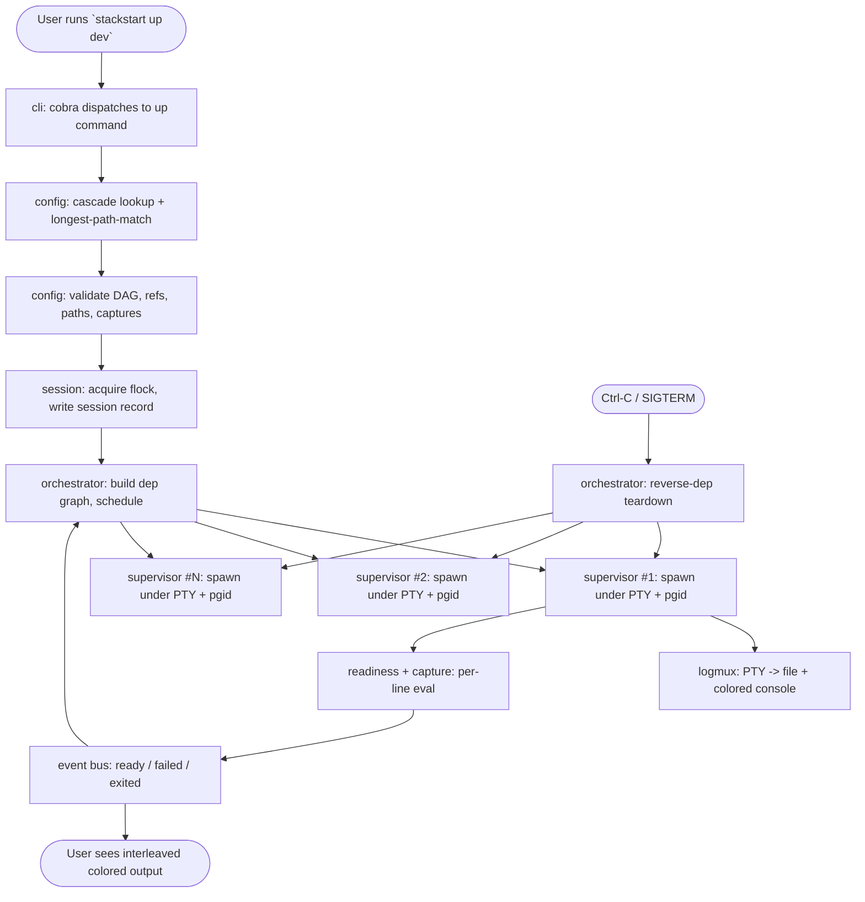
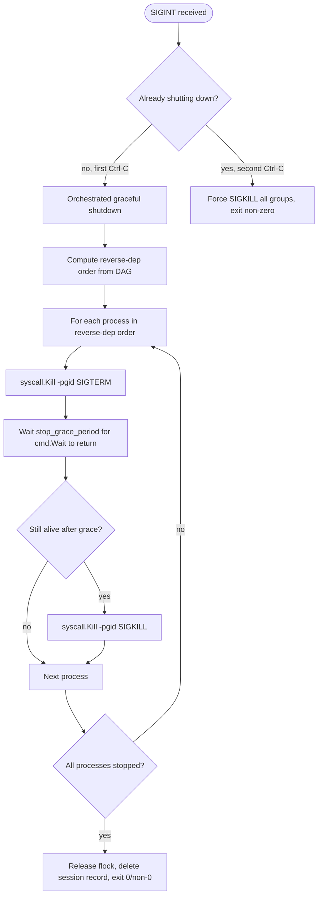

<!-- Stackstart - https://github.com/orpic/stack-start -->
<!-- Copyright (c) 2026 Shobhit. All rights reserved. See LICENSE. -->

# Stackstart - Technical Design

This document is the implementation-side companion to [PRD.md](PRD.md). The PRD defines **what** stackstart is and **what** it must do; this document defines **how** the v1 binary is built in Go.

Reading order: skim sections 1-2 for the high-level shape; sections 3-4 for project layout and dependencies; sections 5-6 for the user-facing schema and reference syntax; sections 7-12 for the runtime (lookup, supervision, readiness, env, IPC, logging); sections 13-15 for CLI / testing / release.

---

## 1. Purpose & relationship to PRD

- **PRD.md** is the contract. It enumerates functional requirements (F1-F11) and non-functional requirements (NFR1-NFR7) that v1 must satisfy.
- **TECH.md** (this document) specifies the architecture, package structure, libraries, algorithms, and on-disk schemas that implement the PRD.
- When the two documents disagree, the PRD wins. If a PRD requirement turns out to be infeasible during implementation, the PRD is amended first; this document is updated second.
- A small number of PRD-deferred decisions (config format, exact reference syntax, etc.) are finalized in this document; those finalizations are noted inline as "**locks PRD section X**."

## 2. High-level architecture

A single static Go binary (`stackstart`) that does three things sequentially when you run `stackstart up <name>`:

1. **Resolve** - find the right profile in the right `stackstart.yaml` for the current cwd.
2. **Validate** - parse it, check the dependency DAG, check capture references, check path constraints.
3. **Orchestrate** - spawn each process under a supervisor goroutine, wait for readiness in dependency order, propagate captured values into dependents' environments, stream logs to console + per-process log files, handle Ctrl-C with a graceful tear-down.



Concurrency model:

- The CLI runs in the main goroutine; the orchestrator runs in a goroutine spawned from `up`.
- Each supervised process gets its own goroutine for `cmd.Wait()` plus another for log multiplexing (one goroutine per child reading from the PTY master fd).
- A central `events` channel carries per-process state transitions; the orchestrator reads it and decides which dependents are now eligible to start.
- Everything is rooted in a single `context.Context` derived from the `up` invocation. Ctrl-C cancels the root context; downstream goroutines respect cancellation and exit cleanly.

## 3. Stack & dependencies

Stackstart vendors a deliberately small dependency surface. Every dep below is justified inline; we reject anything that would pull in transitive complexity beyond what its narrow job needs.

- **`github.com/spf13/cobra`** - CLI framework. Industry standard for Go CLIs (kubectl, gh, hugo). Provides subcommands, flag parsing, generated help, and shell completion. Pulls in `spf13/pflag`. Stable, well-maintained.
- **`gopkg.in/yaml.v3`** - YAML parser. The canonical Go YAML library. Supports comments, anchors, and the strictness we need for clear error messages.
- **`github.com/creack/pty`** - PTY (pseudo-terminal) creation for child processes. Tiny dependency, single-purpose, used by ttyd, gotty, and most Go process supervisors.
- **`github.com/fatih/color`** - ANSI color output for the interleaved console writer. Tiny, well-tested. Alternative considered: `charmbracelet/lipgloss` (rejected: bigger, geared toward TUIs which we explicitly are not building in v1).
- **`github.com/stretchr/testify/require`** - test assertions with clean failure messages and short-circuit-on-failure semantics.
- **`log/slog`** (stdlib, Go 1.21+) - structured logging for stackstart's own diagnostic logs (NOT child process output). Zero external dep. Defaults to a JSON handler in CI / `--log-format=json`, text handler for interactive use.
- **`text/template`** (stdlib) - file template rendering for the optional `templates:` block on processes. Stdlib-only.
- **`syscall`** (stdlib) - process group setup (`Setpgid`), file locking (`Flock`), signal sending. Platform-specific code lives behind build tags (see section 8).

Build / dev tooling (not vendored at runtime):

- **`golangci-lint`** - aggregated linter (errcheck, govet, ineffassign, staticcheck, gosimple, unused, gofmt). Enforced in CI.
- **`goreleaser`** - cross-platform release pipeline (binaries + GitHub Release + Homebrew formula).

There is **no** runtime dependency on Docker, container runtimes, system shells beyond `/bin/sh` for executing `cmd:` strings, terminal emulators, or any database. The only **soft** runtime dependency is `direnv`, used only when a profile's project tree contains a `.envrc` file.

## 4. Project layout

The repository follows the standard Go CLI layout: a thin `cmd/` entrypoint and a fat `internal/` tree of single-purpose packages. Everything under `internal/` is private to this module by Go's `internal/` convention - no external project can import it.

```
stack-start/
  cmd/
    stackstart/
      main.go                  # entrypoint - parses build-time version vars,
                               # constructs root cobra command, runs it
  internal/
    cli/                       # one file per subcommand
      root.go                  # root cobra command + global flags
      up.go                    # `stackstart up <profile>`
      down.go                  # `stackstart down [--profile <name>]`
      logs.go                  # `stackstart logs <process> [--profile <name>]`
      status.go                # `stackstart status`
      list.go                  # `stackstart list`
      init.go                  # `stackstart init` (scaffolds a starter YAML)
      validate.go              # `stackstart validate <profile>`
    config/                    # YAML schema + parser + profile resolver
      schema.go                # Go structs that mirror the YAML schema
      parse.go                 # yaml.v3 unmarshalling + structural validation
      validate.go              # semantic validation (DAG, paths, refs, captures)
      resolve.go               # cascade walk + longest-path-match algorithm
      testdata/                # fixture YAML files
    env/                       # environment composition
      envrc.go                 # direnv shellout + native plain-export parser
      dotenv.go                # .env file parser
      compose.go               # apply precedence: shell -> envrc -> .env -> per-process -> captures
    interpolate/               # ${producer.name} resolver for env values and cmd strings
      lex.go                   # tokenize ${...} occurrences
      resolve.go               # resolve against capture map + envrc map
    template/                  # text/template wrapper for file rendering
      render.go                # render src -> dst with capture/envrc data
    supervisor/                # process spawn, PTY, pgid, signal handling
      supervisor.go            # high-level lifecycle (start, watch, stop)
      pty_unix.go              # creack/pty spawn under build tag `unix`
      pgid_unix.go             # SysProcAttr Setpgid + group signal helpers
      signal.go                # SIGINT/SIGTERM catcher + double-Ctrl-C escape
    readiness/                 # readiness check implementations
      check.go                 # Check interface + result types
      log_regex.go             # log-regex check
      tcp_port.go              # TCP-port check
      evaluator.go             # multi-check AND/OR evaluator + timeout enforcement
    capture/                   # capture engine
      capture.go               # Capture struct, regex compilation, scanner integration
      registry.go              # in-memory map of {producer -> {name -> value}}
    session/                   # cross-shell session record + locking
      record.go                # session JSON schema + read/write
      lock.go                  # flock acquire/release
      reap.go                  # stale-record GC (PID-not-alive cleanup)
      paths.go                 # XDG_STATE_HOME path resolution
    logmux/                    # PTY -> log file + colored console fan-out
      mux.go                   # tee-style writer to multiple sinks
      color.go                 # stable per-process color assignment
      prefix.go                # "<name> | <line>" formatting
    tail/                      # native log-file tailing for `stackstart logs`
      tail.go                  # open + seek + poll (handles file truncation)
    version/                   # build-time version info
      version.go               # vars set via -ldflags at build time
  e2e/                         # end-to-end tests
    fixtures/                  # YAML profiles for e2e tests
    e2e_test.go                # build binary, run real `stackstart up`
  .github/
    workflows/
      ci.yaml                  # PR: vet + test + golangci-lint
      release.yaml             # tag push: goreleaser release
  .goreleaser.yaml             # release pipeline config
  .golangci.yaml               # linter config
  go.mod
  go.sum
  PRD.md
  TECH.md
  README.md
  PROBLEM_STATEMENT.md
```

- **Module path**: `github.com/orpic/stack-start`
- **Binary name**: `stackstart` (no hyphen)
- **Repo name**: `stack-start` (matches the workspace dir; this is fine and common in Go - the binary name is decided by the directory under `cmd/`)

## 5. Configuration: schema & format

### 5.1 Format

YAML, parsed via `gopkg.in/yaml.v3`. **Locks PRD section 14's "config file format" open question.**

Filename: `stackstart.yaml` (visible, no leading dot - matches PRD F-section).

### 5.2 Top-level structure

A `stackstart.yaml` file contains one or more **profiles**. Each profile contains a map of **processes**. There is no other top-level construct.

```yaml
profiles:
  <profile_name>:
    project_path: <absolute path>          # required only in ~/stackstart.yaml;
                                           # implicit (file's directory) for project-local files
    processes:
      <process_name>:
        kind: oneshot | long-running       # optional, default: long-running
        cwd: <relative path>               # required, relative to project_path
        cmd: <shell command string>        # required
        env:                               # optional
          <KEY>: <value with ${...} refs>
        depends_on: [<process_name>, ...]  # optional
        readiness:                         # optional; if omitted, dependents start on spawn
          timeout: <duration>              # required if `readiness` block exists
          mode: any | all                  # optional, default: all
          checks:                          # required if `readiness` block exists
            - log: <regex>                 # OR
            - tcp: <host:port>
        captures:                          # optional
          - name: <identifier>
            log: <regex with capture group>
            required: true | false         # optional, default: true
        templates:                         # optional
          - src: <relative path>
            dst: <relative path>
        on_exit: fail | ignore             # optional, default: fail
        required: true | false             # optional, default: true
        stop_grace_period: <duration>      # optional, default: 10s
```

### 5.3 Path semantics (share-friendly design)

This is the **key portability property** of stackstart: a `stackstart.yaml` committed to a repo is fully portable across teammates.

- The **profile-level `project_path`** field is the only place an absolute path is permitted - and only in `~/stackstart.yaml`. In a project-local `stackstart.yaml` it is implicit (= the file's directory) and **must not** be written explicitly.
- **Every** path field nested inside a process declaration (`cwd`, template `src`, template `dst`, any future path-bearing field) **MUST** be relative to the profile's `project_path`. Absolute paths are rejected at validation with a clear error.
- This means: Alice clones to `/Users/alice/code/onepiece`, Bob clones to `/Users/bob/work/onepiece`, both run the exact same `stackstart.yaml`, and everything resolves correctly because nothing inside the file is hardcoded to either machine.
- `stackstart init` scaffolds a `stackstart.yaml` already conformant to this rule.

### 5.4 Realistic full example

```yaml
profiles:
  dev:
    processes:
      postgres:
        cwd: packages/db
        cmd: docker compose up postgres
        readiness:
          timeout: 30s
          checks:
            - tcp: localhost:5432

      cloudflared:
        cwd: packages/tunnel
        cmd: cloudflared tunnel --url http://localhost:4000
        readiness:
          timeout: 20s
          checks:
            - log: "https://[a-z0-9-]+\\.trycloudflare\\.com"
        captures:
          - name: url
            log: "(https://[a-z0-9-]+\\.trycloudflare\\.com)"
            required: true

      backend:
        cwd: packages/backend
        cmd: npm run dev
        depends_on: [postgres, cloudflared]
        env:
          TUNNEL_URL: "${cloudflared.url}"
          DATABASE_URL: "${envrc.DATABASE_URL}"
        readiness:
          timeout: 60s
          checks:
            - log: "listening on port 4000"

      web:
        cwd: packages/web
        cmd: npm run dev
        depends_on: [backend]
        on_exit: ignore
        templates:
          - src: packages/web/runtime-config.json.tmpl
            dst: packages/web/runtime-config.json
        readiness:
          timeout: 30s
          checks:
            - tcp: localhost:3000

  minimal:
    processes:
      postgres:
        cwd: packages/db
        cmd: docker compose up postgres
        readiness:
          timeout: 30s
          checks:
            - tcp: localhost:5432
      backend:
        cwd: packages/backend
        cmd: npm run dev
        depends_on: [postgres]
        readiness:
          timeout: 60s
          checks:
            - log: "listening on port 4000"
```

### 5.5 Go schema types (sketch)

```go
// internal/config/schema.go
package config

import "time"

type File struct {
    Profiles map[string]Profile `yaml:"profiles"`
}

type Profile struct {
    ProjectPath string             `yaml:"project_path,omitempty"`
    Processes   map[string]Process `yaml:"processes"`
}

type Process struct {
    Kind            string            `yaml:"kind,omitempty"`            // "oneshot" | "long-running"
    Cwd             string            `yaml:"cwd"`
    Cmd             string            `yaml:"cmd"`
    Env             map[string]string `yaml:"env,omitempty"`
    DependsOn       []string          `yaml:"depends_on,omitempty"`
    Readiness       *Readiness        `yaml:"readiness,omitempty"`
    Captures        []Capture         `yaml:"captures,omitempty"`
    Templates       []Template        `yaml:"templates,omitempty"`
    OnExit          string            `yaml:"on_exit,omitempty"`        // "fail" | "ignore"
    Required        *bool             `yaml:"required,omitempty"`
    StopGracePeriod time.Duration     `yaml:"stop_grace_period,omitempty"`
}

type Readiness struct {
    Timeout time.Duration `yaml:"timeout"`
    Mode    string        `yaml:"mode,omitempty"` // "any" | "all"; default "all"
    Checks  []Check       `yaml:"checks"`
}

type Check struct {
    Log string `yaml:"log,omitempty"` // regex
    TCP string `yaml:"tcp,omitempty"` // host:port
}

type Capture struct {
    Name     string `yaml:"name"`
    Log      string `yaml:"log"` // regex with one capture group
    Required *bool  `yaml:"required,omitempty"` // default true
}

type Template struct {
    Src string `yaml:"src"`
    Dst string `yaml:"dst"`
}
```

## 6. Reference & templating syntax

Two distinct syntaxes, used in two distinct contexts. **Locks PRD section 14's "exact reference syntax" open question.**

### 6.1 `${producer.name}` for env values and cmd strings

Used inside `env:` map values and inside `cmd:` strings. Resolved by stackstart's own small interpolation pass in `internal/interpolate/`.

Producers:

- **Capture references**: `${<process>.<capture_name>}` - e.g. `${cloudflared.url}` resolves to the value captured by the `url` capture on the `cloudflared` process. Resolved at the moment the consuming process starts (which is guaranteed to be after the producer is ready, hence after its required captures have completed).
- **Envrc references**: `${envrc.<VARNAME>}` - e.g. `${envrc.DATABASE_URL}` resolves to the value of `DATABASE_URL` in the resolved `.envrc` environment for the project (see section 10).

Escape: a literal `$` is written `$$`.

Example:

```yaml
backend:
  cmd: "./server --tunnel=${cloudflared.url} --db=${envrc.DATABASE_URL}"
  env:
    TUNNEL_URL: "${cloudflared.url}"
    DOLLAR_LITERAL: "$$50"   # resolves to literal "$50"
```

### 6.2 Go `text/template` syntax inside template files

Used inside files that stackstart renders before a dependent starts (the `templates: [{src, dst}]` block on a process). Resolved by `text/template` from the stdlib.

Inside a template file, both captures and envrc values are accessible via dotted paths on the template data root:

```text
{{ .cloudflared.url }}
{{ .envrc.DATABASE_URL }}
```

The data context passed to the template is a Go `map[string]any` of the form:

```go
{
    "cloudflared": map[string]any{"url": "https://random-words.trycloudflare.com"},
    "envrc":       map[string]any{"DATABASE_URL": "postgres://..."},
}
```

Standard `text/template` features (`{{ if }}`, `{{ range }}`, etc.) are available but not required; v1 documentation will only show simple `{{ .x.y }}` substitution. Loops and conditionals are not opinionated against - they just work because we're using stdlib.

### 6.3 Why two syntaxes

- `${...}` reads naturally inside YAML strings (`"${x.y}"`) and in shell-style `cmd:` strings; using `{{ }}` there would force ugly `"{{ .x.y }}"`.
- `{{ }}` is the native Go template syntax for files; using `${}` there would mean writing our own template engine for files, doubling the surface area for marginal consistency benefit.

This is a trade-off acknowledged once in the docs and never asked about again.

## 7. Profile lookup algorithm

Lookup is a pure function of `(cwd, profile_name)`. There is **no merging** across files. **Locks PRD F5.**

```go
// pseudocode in internal/config/resolve.go

func Resolve(cwd, name string, home string) (Profile, FilePath, error) {
    candidates := []candidate{}

    // 1. Walk from cwd upward to filesystem root, collecting matches
    for dir := cwd; dir != "/" && dir != ""; dir = filepath.Dir(dir) {
        path := filepath.Join(dir, "stackstart.yaml")
        if file, err := readFile(path); err == nil {
            for _, p := range file.Profiles {
                if p.Name == name {
                    // Project-local: project_path implicit = file's directory
                    pp := p.ProjectPath
                    if pp == "" {
                        pp = dir
                    }
                    if isWithinOrEqual(cwd, pp) {
                        candidates = append(candidates, candidate{p, path, pp})
                    }
                }
            }
        }
    }

    // 2. Consult ~/stackstart.yaml last
    userPath := filepath.Join(home, "stackstart.yaml")
    if file, err := readFile(userPath); err == nil {
        for _, p := range file.Profiles {
            if p.Name == name && p.ProjectPath != "" && isWithinOrEqual(cwd, p.ProjectPath) {
                candidates = append(candidates, candidate{p, userPath, p.ProjectPath})
            }
        }
    }

    if len(candidates) == 0 {
        return Profile{}, "", ErrNoMatchingProfile
    }

    // 3. Tie-break: longest project_path wins (handles nested projects)
    sort.Slice(candidates, func(i, j int) bool {
        return len(candidates[i].projectPath) > len(candidates[j].projectPath)
    })

    return candidates[0].profile, candidates[0].file, nil
}
```

Notes:

- The walk stops at the filesystem root. We do NOT walk past `/`.
- A project-local `stackstart.yaml` MUST NOT contain a `project_path:` field; if it does, it's a validation error (see section 5.3 - portability).
- A user-level `~/stackstart.yaml` profile MUST contain `project_path:`; missing it makes the profile invisible to the lookup (also a validation warning).
- "Within or equal" means filepath-prefix match at directory boundaries. `/a/b/c` is within `/a/b` but not within `/a/bx`.

## 8. Process supervision

This is the runtime core. Each process declared in a profile gets a `Supervisor` instance.

### 8.1 PTY spawn

Each child is spawned attached to a PTY, not pipes. Reasoning: child processes that detect a TTY (npm, cargo, vite, anything using `isatty`) emit ANSI color and use line-buffered output by default - exactly what we want. Pipes would require setting `FORCE_COLOR=1` / `CLICOLOR_FORCE=1` / `TERM=xterm-256color` in the child env and hoping each tool honors them, which not all do.

Trade-off: a single PTY merges stdout and stderr. **Locks PRD F2.1**: in v1, log-regex readiness checks scan the merged stream; the per-check `stream:` selector is removed (always "both"). This is a documented amendment to PRD section 6 and F2.1 (see section 16 of this doc).

```go
// internal/supervisor/pty_unix.go
//go:build unix

package supervisor

import (
    "os/exec"
    "syscall"

    "github.com/creack/pty"
)

func spawnPTY(cmd *exec.Cmd) (ptyMaster *os.File, err error) {
    cmd.SysProcAttr = &syscall.SysProcAttr{
        Setpgid: true,   // own process group; see section 8.2
    }
    return pty.Start(cmd)
}
```

Windows is explicitly out of v1; the `pty_unix.go` build tag is the only PTY implementation we ship.

### 8.2 Process group (pgid) for clean kill

Every child runs in its own process group via `SysProcAttr{Setpgid: true}`. This means when the child forks grandchildren (e.g. `npm run dev` -> `node` + `webpack` + `vite`), they all join the same group.

To shut a process down cleanly we send signals to the **process group**, not just the direct PID:

```go
// internal/supervisor/pgid_unix.go
//go:build unix

func signalGroup(pid int, sig syscall.Signal) error {
    // Negative PID = "send to entire process group"
    return syscall.Kill(-pid, sig)
}
```

This is the difference between "node and webpack die when you Ctrl-C" and "node dies but webpack lingers as a zombie eating a port" - a real source of pain in hand-rolled supervisors.

### 8.3 Lifecycle states

A supervised process moves through these states, written into the per-process state file (see section 11):

- `pending` - declared in the profile, dependencies not yet ready
- `starting` - spawned, PTY attached, readiness checks running
- `ready` - all readiness checks passed, all required captures resolved. For oneshot processes: exited with code 0 (and checks satisfied if any were defined).
- `failed` - readiness timed out, capture missed, exited during readiness wait, or (for oneshot) exited with non-zero code.
- `exited` - exited cleanly post-ready (with `on_exit: ignore`). Not used for oneshot processes.

State transitions are emitted onto the central `events` channel; the orchestrator reacts to `ready` events to release dependents. For oneshot processes, the `ready` event is emitted only from the wait loop (after exit code is known), never from the scan loop.

### 8.4 Signal handling and orchestrated shutdown

Stackstart catches SIGINT (Ctrl-C) and SIGTERM in the main process. It does NOT let the kernel propagate the signal to children directly - because each child is in its own process group, the kernel's foreground-process-group signal delivery doesn't reach them, which is exactly what we want: stackstart owns the shutdown choreography.

Shutdown flow on Ctrl-C:



The double-Ctrl-C escape is critical UX: if a child ignores SIGTERM (broken signal handler, infinite loop in shutdown hook), the user can press Ctrl-C again to force-kill everything immediately rather than wait out N processes' worth of `stop_grace_period`.

### 8.5 Shutdown ordering

Shutdown runs in **reverse dependency order**. If the dep DAG was `db <- backend <- web`, shutdown order is `web`, then `backend`, then `db`. This minimizes "downstream still-running processes hammering an already-dead upstream" log noise during shutdown.

In practice the per-process shutdowns kick off in parallel within each "layer" of the reverse-dep order, with a brief wait between layers. Implementation detail; the user never sees this complexity.

## 9. Readiness & capture engine

Readiness checks and captures both operate on the **merged PTY output stream** of a single process. They are evaluated together, per line, by a single line scanner per process.

### 9.1 Per-line scanner

```go
// inside supervisor goroutine for a process
scanner := bufio.NewScanner(ptyMaster)
for scanner.Scan() {
    line := scanner.Bytes()

    // Tee to logmux (file + console)
    logmux.Write(line)

    // Evaluate against all readiness checks
    for _, check := range readinessChecks {
        check.Evaluate(line)
    }

    // Evaluate against all captures
    for _, cap := range captures {
        if matched, value := cap.Match(line); matched {
            captureRegistry.Store(processName, cap.Name, value)
        }
    }

    // After every line: check if (all required captures done) AND (readiness mode satisfied)
    if allRequiredCapturesDone() && readinessSatisfied() {
        emitReadyEvent()
        break // stop evaluating; just keep tee'ing to logmux
    }
}
```

### 9.2 Readiness check types

#### `log: <regex>`

Per-line, unanchored substring match (`grep` semantics). Compiled once with `regexp.MustCompile`. Matches against the line bytes; no normalization.

```go
type LogRegexCheck struct {
    Pattern *regexp.Regexp
    matched atomic.Bool
}

func (c *LogRegexCheck) Evaluate(line []byte) {
    if c.matched.Load() {
        return
    }
    if c.Pattern.Match(line) {
        c.matched.Store(true)
    }
}

func (c *LogRegexCheck) Satisfied() bool { return c.matched.Load() }
```

#### `tcp: <host:port>`

Periodically attempts a TCP connection. A check is satisfied the first time `net.DialTimeout("tcp", "host:port", 1s)` returns nil error.

The TCP poller runs as a separate goroutine for each TCP check, polling at a small fixed interval (200ms is the implementation default, not user-configurable in v1). It exits as soon as one connection succeeds or the readiness timeout expires.

```go
type TCPCheck struct {
    Address string
    matched atomic.Bool
}

func (c *TCPCheck) Run(ctx context.Context) {
    ticker := time.NewTicker(200 * time.Millisecond)
    defer ticker.Stop()
    for {
        select {
        case <-ctx.Done():
            return
        case <-ticker.C:
            conn, err := net.DialTimeout("tcp", c.Address, time.Second)
            if err == nil {
                conn.Close()
                c.matched.Store(true)
                return
            }
        }
    }
}
```

### 9.3 Mode evaluation

A process's `readiness.checks` is evaluated as either `all` (every check satisfied) or `any` (at least one check satisfied), per the `readiness.mode` field. Default is `all`.

```go
func (e *Evaluator) Satisfied() bool {
    if e.Mode == "any" {
        for _, c := range e.Checks {
            if c.Satisfied() {
                return true
            }
        }
        return false
    }
    // mode == "all"
    for _, c := range e.Checks {
        if !c.Satisfied() {
            return false
        }
    }
    return true
}
```

### 9.4 Mandatory timeout

`readiness.timeout` is a required field (no default). The evaluator runs under a `context.WithTimeout(parent, timeout)`. When the context expires:

- The process is marked `failed` with attribution: which check(s) had not yet satisfied.
- The orchestrator triggers an orchestrated shutdown of the whole stack (per `on_exit: fail` default).

### 9.5 Captures

A capture has a name, a regex with exactly one capturing group (parens), and a `required` flag (default true).

```go
type Capture struct {
    Name     string
    Pattern  *regexp.Regexp
    Required bool
    captured atomic.Pointer[string]
}

func (c *Capture) Match(line []byte) (bool, string) {
    if c.captured.Load() != nil {
        return false, ""
    }
    sub := c.Pattern.FindSubmatch(line)
    if len(sub) < 2 {
        return false, ""
    }
    val := string(sub[1])
    c.captured.Store(&val)
    return true, val
}
```

Validation rejects captures whose regex has zero or more than one capturing group.

A process is **not** considered ready until all `required: true` captures have completed, even if the readiness checks themselves pass first. This is what guarantees dependents never see a missing capture - section 9.1's `allRequiredCapturesDone() && readinessSatisfied()` predicate.

Captured values are stored in an in-memory registry (`internal/capture/registry.go`) keyed by `(process_name, capture_name)`. Dependents reference values via `${producer.name}` (env/cmd) or `{{ .producer.name }}` (templates), resolved at the moment the consuming process starts.

## 10. Environment composition

A process's effective environment is computed once, at the moment of spawn, by composing five layers in increasing precedence (later layers override earlier on key collision):

1. **Inherited shell env** - the entire `os.Environ()` at the time `stackstart up` was invoked.
2. **`.envrc` resolved env** - if a `.envrc` exists at `project_path` or any ancestor up to `project_path`. See section 10.1.
3. **`.env` file** - if `<project_path>/.env` exists. Plain `KEY=value` parser.
4. **Per-process `env:` block** - the YAML map. Values may contain `${producer.name}` and `${envrc.VAR}` references, resolved here.
5. **Resolved capture references** - any `${producer.name}` references in step 4 are substituted with their current captured values.

### 10.1 `.envrc` handling

`.envrc` files are direnv's domain. Two paths, decided at startup:

- **If `direnv` is on `PATH`**: shell out to `direnv exec <project_path> env -0`. Parse the NUL-separated `KEY=value` output. This handles all direnv directives correctly (`source_up`, `dotenv`, `layout`, `use`, conditionals, subshells).
- **If `direnv` is NOT on `PATH`**: stackstart's native parser is used. It accepts a strict subset only:
  - `export VAR=value`
  - `export VAR="quoted value"`
  - `export VAR='single-quoted'`
  - blank lines
  - `# comments`
  
  Anything else (`source_up`, `dotenv`, `if [...]`, `$(...)`, etc.) is a hard error: `"this .envrc requires direnv to evaluate; install direnv via 'brew install direnv' and run 'direnv allow'"`.

### 10.2 `.env` handling

Stackstart's own minimal parser. Lines look like `KEY=value` or `KEY="quoted value"`. Comments with `#`. No `export ` prefix expected (this is `.env`, not `.envrc`). No directives or expressions.

### 10.3 Composition pseudocode

```go
// internal/env/compose.go
func Compose(p Profile, proc Process, captures CaptureRegistry) ([]string, error) {
    envMap := map[string]string{}

    // Layer 1: inherited shell env
    for _, kv := range os.Environ() {
        k, v := splitKV(kv)
        envMap[k] = v
    }

    // Layer 2: .envrc
    if envrcEnv, err := loadEnvrc(p.ProjectPath); err == nil {
        for k, v := range envrcEnv {
            envMap[k] = v
        }
    }

    // Layer 3: .env
    if dotenv, err := loadDotenv(filepath.Join(p.ProjectPath, ".env")); err == nil {
        for k, v := range dotenv {
            envMap[k] = v
        }
    }

    // Layer 4 + 5: per-process env with reference resolution
    refData := buildRefData(captures, envMap) // exposes envrc.VAR + producer.name
    for k, v := range proc.Env {
        resolved, err := interpolate.Resolve(v, refData)
        if err != nil {
            return nil, fmt.Errorf("env %s: %w", k, err)
        }
        envMap[k] = resolved
    }

    return mapToSlice(envMap), nil
}
```

## 11. Cross-shell IPC

Stackstart has no daemon. To make `down`, `logs`, and `status` work from a shell other than the one running `up`, we use **file-based discovery** under XDG state.

### 11.1 Paths

```
$XDG_STATE_HOME/stackstart/                       # default: ~/.local/state/stackstart
  sessions/
    <slug>.json                                   # session record (one per running session)
    <slug>.lock                                   # flock target (one per session)
    <slug>/                                       # per-session subdir
      <process>.state                             # one file per supervised process
      <process>.log                               # PTY output log
      stackstart.log                              # orchestrator's own diag log (slog output)
```

`<slug>` is human-readable: `<project_path_with_slashes_to_underscores>__<profile_name>`. Example: `Users_shobhit_code_onepiece__dev`. This makes `ls ~/.local/state/stackstart/sessions/` immediately legible.

XDG resolution: respect `$XDG_STATE_HOME` if set; otherwise default to `~/.local/state` (Linux) and `~/Library/Application Support` (macOS - macOS doesn't have a true XDG state convention, so we follow a sensible analogue).

### 11.2 Session record schema

```json
{
  "slug": "Users_shobhit_code_onepiece__dev",
  "profile": "dev",
  "project_path": "/Users/shobhit/code/onepiece",
  "config_file": "/Users/shobhit/code/onepiece/stackstart.yaml",
  "stackstart_pid": 41234,
  "stackstart_version": "0.1.0",
  "started_at": "2026-04-25T18:30:00+05:30",
  "log_dir": "/Users/shobhit/.local/state/stackstart/sessions/Users_shobhit_code_onepiece__dev",
  "processes": [
    {"name": "postgres",    "pid": 41235, "log_file": ".../postgres.log",    "state_file": ".../postgres.state"},
    {"name": "cloudflared", "pid": 41236, "log_file": ".../cloudflared.log", "state_file": ".../cloudflared.state"},
    {"name": "backend",     "pid": 41237, "log_file": ".../backend.log",     "state_file": ".../backend.state"},
    {"name": "web",         "pid": 41238, "log_file": ".../web.log",         "state_file": ".../web.state"}
  ]
}
```

The session record is written once on `up` (after the lock is acquired and processes have been spawned) and rewritten only when child PIDs change (e.g. on graceful exit).

### 11.3 Per-process state files

Tiny single-line JSON updated on each transition:

```json
{"state":"ready","since":"2026-04-25T18:30:14+05:30","pid":41236}
```

Possible `state` values: `pending`, `starting`, `ready`, `failed`, `exited` (matching section 8.3).

Atomic writes: write to `<process>.state.tmp`, `os.Rename` to `<process>.state`. Readers may briefly miss a transition; this is acceptable for `status` polling.

### 11.4 Locking (`flock`)

On `up`:

1. Open `<slug>.lock` with `O_CREAT|O_RDWR`.
2. `syscall.Flock(fd, LOCK_EX|LOCK_NB)`. If it fails with `EWOULDBLOCK`, error with `"profile <name> is already running for project <path>; see 'stackstart status'"`.
3. Hold the fd for the lifetime of the session.

`flock` is automatically released by the kernel when the holding process dies (including from `kill -9`). This is the critical property that makes file-based locking robust without a stale-lock-cleanup dance.

### 11.5 Stale reaping

On every `up` and `status`:

1. List `<XDG_STATE>/stackstart/sessions/*.json`.
2. For each, read `stackstart_pid` and check `syscall.Kill(pid, 0)` (signal 0 = "is this PID alive?"). On `ESRCH`, the process is gone.
3. If gone, remove the session record JSON, the lock file, and the per-session subdir.

This catches the rare case where stackstart was hard-killed in a way that left state files behind even after flock released.

### 11.6 Cross-shell command implementations

- **`stackstart down [--profile <name>]`** - locate the matching session record (by current cwd context + optional `--profile`), read `stackstart_pid`, send SIGTERM. The running stackstart's signal handler does the orchestrated shutdown (section 8.4). The other shell waits a few seconds polling for the session record to disappear, then prints "stopped".
- **`stackstart logs <process> [--profile <name>]`** - locate session record, read the `<process>.log` path, native Go tail (open + `Seek(0, io.SeekEnd)` + poll for new bytes; handle truncation by checking inode + size on each poll cycle).
- **`stackstart status`** - list all session JSONs (after stale reap), read each one + its per-process state files, render a human table to stdout.

## 12. Logging multiplexer

Each process's PTY output stream is fan-out to two sinks via `internal/logmux`:

1. **The per-process log file** (`<slug>/<process>.log`) - raw bytes, no prefix, no color manipulation. Any tool reading the log file gets exactly what the child wrote.
2. **The interleaved console writer** (stackstart's stdout) - prefixed with `<padded-name> | ` and colored. Color is ANSI-aware: if the child wrote ANSI codes, they pass through; we add our own color only to the prefix.

### 12.1 Per-process color assignment

We use a small fixed palette (8 distinguishable colors that work on dark and light terminals) and assign each process a color via stable hashing of its name:

```go
// internal/logmux/color.go
var palette = []color.Attribute{
    color.FgCyan, color.FgGreen, color.FgYellow, color.FgMagenta,
    color.FgBlue, color.FgRed, color.FgHiCyan, color.FgHiGreen,
}

func ColorFor(name string) color.Attribute {
    h := fnv.New32a()
    h.Write([]byte(name))
    return palette[int(h.Sum32())%len(palette)]
}
```

Stable across runs: same process name -> same color.

### 12.2 Prefix formatting

Process names are left-aligned and padded to the length of the longest process name in the profile (computed once at start). Pipe separator. Then the line content.

Example output for a profile with processes `postgres`, `cloudflared`, `backend`, `web` (longest = 11 chars):

```
postgres    | LOG:  database system is ready to accept connections
cloudflared | 2026-04-25T13:00:14Z INF Connection registered connIndex=0
cloudflared | 2026-04-25T13:00:14Z INF +-----------+
cloudflared | 2026-04-25T13:00:14Z INF | Your tunnel: https://random-words.trycloudflare.com |
backend     | listening on port 4000
web         | VITE v5.0.0  ready in 423 ms
```

Each prefix is colored per process; the line content is whatever the child emitted (ANSI codes preserved).

### 12.3 Implementation sketch

```go
// internal/logmux/mux.go
type Mux struct {
    name      string
    padTo     int
    color     color.Attribute
    fileWriter io.Writer
    consoleWriter io.Writer
}

func (m *Mux) Write(line []byte) {
    // Always write raw to file
    m.fileWriter.Write(append(line, '\n'))

    // Write prefixed + colored to console
    prefix := fmt.Sprintf("%-*s | ", m.padTo, m.name)
    coloredPrefix := color.New(m.color).Sprint(prefix)
    m.consoleWriter.Write([]byte(coloredPrefix))
    m.consoleWriter.Write(line)
    m.consoleWriter.Write([]byte("\n"))
}
```

Console writes are serialized via a single mutex shared across all `Mux` instances in a session, so two processes emitting simultaneously never produce torn lines.

## 13. CLI surface

All commands implemented as cobra subcommands in `internal/cli/`. The root command (`internal/cli/root.go`) defines global flags and dispatches.

### 13.1 Commands

| Command | Synopsis | File |
|---|---|---|
| `up <profile>` | Resolve, validate, run | `up.go` |
| `down [--profile <name>]` | Send SIGTERM to running session | `down.go` |
| `logs <process> [--profile <name>]` | Tail per-process log | `logs.go` |
| `status` | List running sessions, per-process state | `status.go` |
| `list` | List profiles available from cwd context | `list.go` |
| `init` | Scaffold a starter `stackstart.yaml` | `init.go` |
| `validate <profile>` | Parse + validate, no spawn | `validate.go` |

### 13.2 Global flags

- `--config <path>` - override the cascade lookup, point at an explicit `stackstart.yaml`.
- `--log-format text|json` - controls slog handler used for stackstart's diagnostic logs.
- `--quiet` - suppress stackstart's own diagnostic output (children's output still streams).
- `--version` - print version.

### 13.3 Exit codes

- `0` - success (`up` ran clean and the user stopped it intentionally; `validate` passed; `status` ran).
- `1` - generic error (unknown).
- `2` - config error (parse failure, validation failure, profile not found).
- `3` - readiness or capture failure (a process failed to become ready).
- `4` - process exited unexpectedly post-ready with `on_exit: fail`.
- `5` - already running (flock contention).
- `130` - SIGINT (user Ctrl-C of a healthy stack - convention).

## 14. Testing strategy

### 14.1 Unit tests (per package)

Every `internal/<pkg>` has a `<pkg>_test.go` using stdlib `testing` + `testify/require`. Coverage target ~70% for v1, enforced as a soft gate (warn, don't fail PR).

Examples:

- `internal/config/parse_test.go` - parses every fixture in `testdata/`, asserts on the resulting Go struct.
- `internal/config/validate_test.go` - feeds intentionally broken configs (cycles, absolute paths, missing capture refs), asserts on error contents.
- `internal/config/resolve_test.go` - synthesizes temp directory trees, asserts on which profile lookup picks.
- `internal/interpolate/resolve_test.go` - table-driven tests for `${producer.name}` and `${envrc.VAR}` resolution including escape `$$`.
- `internal/readiness/log_regex_test.go` - feeds lines, asserts `Satisfied()` transitions.
- `internal/session/lock_test.go` - acquires lock, forks helper process trying to re-acquire, asserts `EWOULDBLOCK`.

### 14.2 End-to-end tests

In `e2e/`, a single test binary that:

1. Builds the `stackstart` binary into a `t.TempDir()` (one-time per test run via `sync.Once`).
2. For each test case: writes a fixture `stackstart.yaml` in a temp project dir, runs `stackstart up <profile>` as a real subprocess, asserts on:
   - Exit code
   - Per-process log file contents
   - Session record JSON contents
   - Stale reaping behavior (kill -9 the stackstart process, verify next `status` cleans up)

Fixture commands use cheap shell builtins:

```yaml
profiles:
  basic:
    processes:
      sleeper:
        cwd: .
        cmd: sh -c "echo READY; sleep 60"
        readiness:
          timeout: 5s
          checks:
            - log: "READY"
```

For TCP readiness e2e, use `nc -l <port>` (BSD netcat on macOS, GNU netcat on Linux - the small invocation differences are abstracted in a test helper).

### 14.3 What we don't test

- We do NOT test direnv shellout in CI (would require installing direnv in CI runners). Native `.envrc` parser path IS tested unit-style.
- We do NOT test `stackstart logs` interactively; we test the `tail` package's polling logic via a unit test that writes to a file and asserts the tailer sees the new bytes.

## 15. CI and release

### 15.1 PR workflow (`.github/workflows/ci.yaml`)

Triggered on every PR and push to `main`:

```yaml
name: ci
on: [pull_request, push]
jobs:
  test:
    runs-on: ${{ matrix.os }}
    strategy:
      matrix:
        os: [ubuntu-latest, macos-latest]
    steps:
      - uses: actions/checkout@v4
      - uses: actions/setup-go@v5
        with: { go-version: 'stable' }
      - run: go vet ./...
      - run: go test ./...
      - uses: golangci/golangci-lint-action@v6
        with: { version: latest }
```

### 15.2 Release workflow (`.github/workflows/release.yaml`)

Triggered on `v*` tag push:

```yaml
name: release
on:
  push:
    tags: ['v*']
jobs:
  release:
    runs-on: ubuntu-latest
    steps:
      - uses: actions/checkout@v4
        with: { fetch-depth: 0 }
      - uses: actions/setup-go@v5
        with: { go-version: 'stable' }
      - uses: goreleaser/goreleaser-action@v6
        with:
          version: latest
          args: release --clean
        env:
          GITHUB_TOKEN: ${{ secrets.GITHUB_TOKEN }}
          HOMEBREW_TAP_TOKEN: ${{ secrets.HOMEBREW_TAP_TOKEN }}
```

### 15.3 `.goreleaser.yaml` sketch

```yaml
project_name: stackstart
builds:
  - id: stackstart
    main: ./cmd/stackstart
    binary: stackstart
    env: [CGO_ENABLED=0]
    goos: [darwin, linux]
    goarch: [amd64, arm64]
    ldflags:
      - -s -w
      - -X github.com/orpic/stack-start/internal/version.Version={{.Version}}
      - -X github.com/orpic/stack-start/internal/version.Commit={{.Commit}}
      - -X github.com/orpic/stack-start/internal/version.Date={{.Date}}

archives:
  - format: tar.gz
    name_template: "stackstart_{{ .Version }}_{{ .Os }}_{{ .Arch }}"

brews:
  - repository:
      owner: orpic
      name: homebrew-tap
      token: "{{ .Env.HOMEBREW_TAP_TOKEN }}"
    homepage: https://github.com/orpic/stack-start
    description: "Runtime-aware local dev orchestrator"
    license: "MIT"
    test: |
      system "#{bin}/stackstart --version"
```

### 15.4 Brew tap

A separate repo at `github.com/orpic/homebrew-tap` (shared across any future tools, not stackstart-specific). goreleaser auto-pushes `Formula/stackstart.rb` on each release.

User installation:

```bash
brew tap orpic/tap
brew install stackstart
```

### 15.5 Versioning

Semantic versioning. Initial release at `v0.1.0` (pre-stable; minor versions may break compatibility). Promote to `v1.0.0` once the locked v1 scope ships and has had one round of real-world feedback.

Version info accessible at runtime via `stackstart --version`, populated from the ldflags-injected vars in `internal/version/version.go`:

```go
package version

var (
    Version = "dev"
    Commit  = "none"
    Date    = "unknown"
)
```

### 15.6 `.golangci.yaml` enabled linters

```yaml
linters:
  enable:
    - errcheck
    - govet
    - ineffassign
    - staticcheck
    - gosimple
    - unused
    - gofmt
    - misspell
```

## 16. Required PRD amendments

The following spec-side adjustments to `PRD.md` are needed for it to stay consistent with the implementation choices locked in this document. They will be applied as a follow-up edit pass.

1. **Section 9 (UX walkthrough)**: remove the `stackstart up <name> --tabs` paragraph (the tabs feature is dropped from v1).
2. **Section 10 F11**: delete the entire F11 block.
3. **Section 12 (out of scope)**: replace "Terminal integrations beyond macOS Terminal.app and Linux gnome-terminal" with "Terminal-tab spawning of any kind (deferred to v1.x)."
4. **Section 15 v1 cut summary**: remove the trailing sentence about `--tabs`.
5. **Section 14 open questions**: remove the "Config file format" bullet (now locked as YAML, see TECH section 5.1) and the "Stop signal default sequencing" bullet (now finalized, see TECH section 8.4).
6. **Section 5 (Core concepts) - Readiness check description**: remove "stdout, stderr, or both" wording.
7. **F2.1**: replace with "log-regex readiness, per-line unanchored, scanned over the merged stdout+stderr stream (PTY-based; see [TECH.md](TECH.md) section 8)."
8. **Section 6 conceptual sketch**: remove the `stream: both` line on the cloudflared check.
9. **Section 3 (target users)** and **Section 6 sketch description**: add a one-line callout that project-committed `stackstart.yaml` is share-friendly by design - any teammate cloning the repo runs `stackstart up <name>` and it just works because no path inside a process is allowed to be absolute.

## 17. Open implementation details

A small number of decisions are explicitly left to the implementation phase, not because they're contentious but because they're easier to settle once code exists:

- Exact size of the per-process color palette (currently 8; may grow to 16 if we hit collision pain).
- Exact log-tail polling interval for `stackstart logs` (likely 50-200ms; needs benchmarking on real log volumes).
- Exact behavior when a `templates: dst` file already exists (current intent: overwrite always, document in scaffolded `init` config that `dst` paths should be `.gitignore`d).
- Exact error message wording for the "common mistakes" set (cycles, missing capture refs, absolute paths, etc.) - will be iterated in PR review.
- Whether to expose `--json` output on `status` in v1 or v1.x (will decide based on how often the maintainer reaches for it during dogfooding).

These do not affect the PRD or the architecture above; they only affect surface polish.
